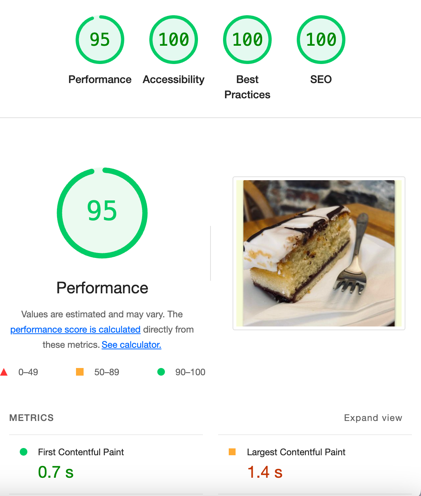

# Brioche Cafe Website

A static site built for the cafe I do a couple of shifts in a week. A great independent cafe/coffeeshop in the alternative capital of Britain, Totnes. Built using Bootstrap to provide a mobile first responsive design, with custom CSS and Javascript providing additional design features. Will be deployed from its own Github account with a custom domain.

## Technologies

[Bootstrap5.3](https://getbootstrap.com) - A library of CSS and Javascript

[Bootstrap Icons](https://icons.getbootstrap.com) - A selection of SVG icons. Free to use

[Google Fonts](https://fonts.google.com) - Free fonts from Google

[Favicon](https://favicon.io) - Free Favicon generator

[Convertio](https://convertio.co) - Free image converter. Used to change jpeg to webp

[Apple Maps Beta](https://beta.maps.apple.com/?ll=50.48122730090053%2C-3.7800370892087187&spn=0.03224970000002969%2C0.04732481436619196) - An alternative to Google Maps

## Performance

Testing was completed using Google Lighthouse.

